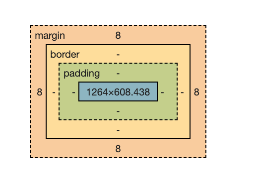

# Bootsrap


- class is for multiple elements
- id for single element


1. **Grid system**

2. **Nav bar**

3. **div** is container

   1. By adding class whaterver changes you apply it will be reflected on div elements

   2. ```html
      <div class = "container"></div>  # codes will be in middle
      <div class = "container -fluid"></div> # from the starting
      ```

   3. boostrap padding class --> go to spacing

   4. search margin and padding

   5. ```html
      <div class = "container mt-4" ></div>  # codes will be in middle will add margine from top 4
      ```

4. for margin use 	

| margin               | description           |
| -------------------- | --------------------- |
| mt - 4 (from 0 to 5) | margin from top       |
| mb                   | margin from bottom    |
| ml                   | margin from top left  |
| mr                   | margin from top right |
| my                   | from top to bottom    |
| mx                   | from sides            |

for padding replace m with p so pt,py .... so on



5. Crousal -slid show
6. cards
7. image responsive
8. header and footer
9. 