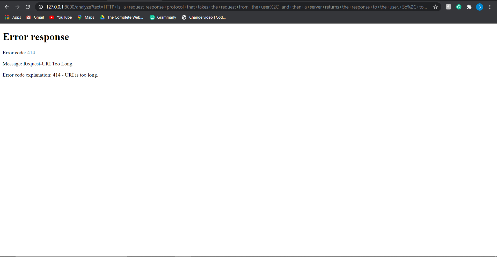

### Exposed test in URL & CSRF Token

As expected, the text is changed to uppercase. Now, notice the  highlighted part of the URL. You can see that the text entered is  exposed in the URL. So the following questions arise here :

- Why is the input text exposed in the URL?
- What if we do not want to show the text in the URL?

Now, I will answer the above questions one by one. So let's start with question 1.

Why is the input text exposed in the URL?

**Ans:** The text is visible in the URL because we are using the GET method for passing the information. HTTP is a request-response protocol that takes the request from the user,  and then a server returns the response to the user. So, to establish  this request-response connection, we need some methods. The two most  commonly used HTTP methods are HTTP GET and POST. So, let's understand  the GET method :

#### HTTP GET :

- The GET method is the default submission method for a form.

- The GET method sends the data in the form of URL parameters.  Therefore, any data sent with the help of the GET method remains visible in the URL. 

- Since the data is exposed in the URL, the GET method is not considered for sending sensitive information such as passwords.

- The GET method reveals the data in the URL bar; therefore, the length of the URL increases. The maximum URL length is 2048 characters, so only a limited amount of data can be sent using the GET method. The  following error occurs when we try to send more than 2048 characters  using GET :

  

Now, we are done with the GET method details, and it's time to answer Que 2.

What if we do not want to show the text in the URL?

**Ans**: If we do not want to expose the data in  the URL bar, we can use the POST method instead of GET. Let's start our  discussion on the POST method :

#### POST :

- Data sent by the POST method never gets visible in the URL  box, and therefore it is more secure than the GET method, and sensitive  information can be sent with the help of this method.
- Since the data is not visible in the URL query, the length of  the URL remains less than 2048 characters, and a large amount of data  can be sent with the help of the POST method.
- Data is sent to the server in the form of packages in a separate communication with the processing script.

Now, we will start our discussion on CSRF tokens.

#### WHAT ARE CSRF TOKENS?

- CSRF stands for Cross-Site Request Forgery.
- The server-side application generates and transmits a huge,  random, and unpredictable number to the client to make sure that the  request is coming from the original client and not from a malicious  website.
- CSRF tokens are used to protect the site against CSRF attacks.

#####  How to include CSRF token on your website :

Type the following code in index.html :

```markup
<form action='/analyze' > 
```

With this, you have successfully included CSRF token to your website. Now, we will see how to use the POST method on our website.

Type the following code in index.html :

```markup
<form action='/analyze' method='post'> 
```

After this, replace all the request.GET.get with the request.POST.get. With this, we have successfully changed the HTTP method of the textutils website.