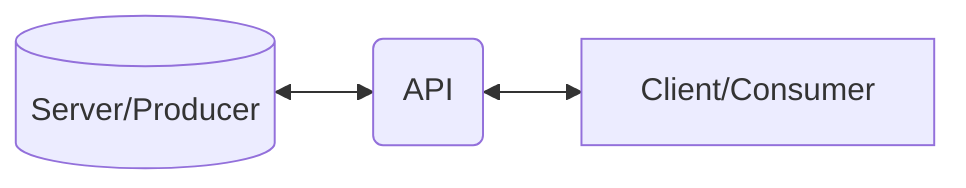
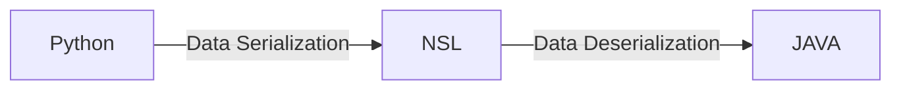

## REST API - Application Program Interface

Our application is not allowed to manage the database and other server-related activities. It is the duty of the API to do these tasks  on the behalf of the application. API acts as a middleman between our  application and the server. 

We can understand the concept of API by taking an example of a  child. A child is never allowed to operate a microwave and other similar things which can be dangerous for him so a child is asked to inform any elder if he needs to operate the microwave. The elder is the middleman  operating between the microwave and the child.  

If the application is allowed to directly access the server  then there might be chances that it can delete the whole server and can  harm the data stored on the server. So that’s why it is not allowed to  directly access the server API acts as a middleman. But if API is  working as a middleman it will not do the same. It will only allow to  perform the limited task for which it is commanded. 

The above things can be explained by again taking the example of a child. if a child persists to buy the whole ice cream shop then his  father will never do this. he will try to convince the child by just  eating single ice cream.

In android, API can be used to retrieve the data from the  database. Data is received in the format of JSON and XML mainly. It can also be in the plain text file format. 

Library is a collection of code itself. But API is a collection of useful techniques or functions. API consists of libraries. API can be made of several libraries to complete an action. A single library in  itself is not an API.  





**NSL** - **N**etwork **S**upport **L**anguage

NSL convert different languages such a way that even there is two different languages data can still be understood by Each one.

Famous NSL languages are :- 

**XML** :- **E**xtensible **M**arkup **L**anguage  Looks quits similar to html

```xml
<name>
    <firstname>Sharique</firstname>
    <LastName>Mohammad</LastName>
</name>
    
```

**Json** :- **J**ava**S**cript **O**bject **N**otation

```json
{"Details":{{"name":"Sharique"},{"Address":"Amaravati"}}
```

for more info [click](https://www.w3schools.com/python/python_json.asp)

When you convert from Python to JSON, Python objects are converted into the JSON (JavaScript) equivalent:

| Python | JSON   |
| ------ | ------ |
| dict   | Object |
| list   | Array  |
| tuple  | Array  |
| str    | String |
| int    | Number |
| float  | Number |
| True   | true   |
| False  | false  |
| None   | null   |

## Data serialization and deserialization

```python
import json
from typing import Type

d = {'a': 1, 'b': 2, 'c': 3}
print("original data")
print(d,type(d))

# serialization
j = json.dumps(d)
print("\nData serialization")
print(j,type(j))

# deserialization
p = json.loads(j)
print("\nData deserialization")
print(p,type(p))
```

Output:-

```powershell
original data
{'a': 1, 'b': 2, 'c': 3} <class 'dict'>

Data serialisation
{"a": 1, "b": 2, "c": 3} <class 'str'>

Data deserialisation
{'a': 1, 'b': 2, 'c': 3} <class 'dict'>
```

---

## Django REST API

- Start new project **Product_REST**.
- Create an app **product**.
- Register app.
- Configure data base '**prod**'.
- Create data base **prod** in **MySQL**. 
- In environment 

```powershell
pip install djangorestframework
```

- Create prod modules:-

  - Address

    ```python
    class Address(models.Model):
        city = models.CharField(max_length=100)
        pincode = models.IntegerField()
        state = models.CharField(max_length=50)
    ```

  - Vendor

    ```python
    class Vendor(models.Model):
        name = models.CharField(max_length=100)
        balance = models.IntegerField()
        address = models.OneToOneField(Address, on_delete=models.CASCADE)
        product = models.ManyToManyField(Product, on_delete=models.CASCADE)
    ```

  - Product

    ```python
    class Product(models.Model):
        name = models.CharField(max_length=100)
        pincode = models.IntegerField()
        pincode = models.IntegerField()
        cat = models.CharField(max_length=100)
        customer = models.ManyToManyField(Customer, on_delete=models.CASCADE)
    ```

  - Customer

    ```python
    class Customer(models.Model):
        name = models.CharField(max_length=100)
        age = models.IntegerField()
        balance = models.IntegerField()
        email = models.EmailField()
    ```

    

