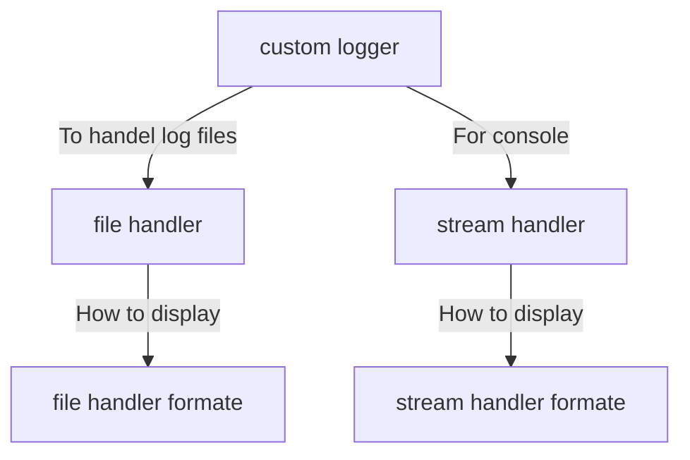
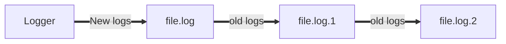

# Logger

RCA - Root Cause Analysis

5 Why?  - Five times why

Don't name any of your python file as logger or logging..

## Loggers level

```python
print(logging.NOTSET)
print(logging.DEBUG)
print(logging.INFO)
print(logging.WARNING)
print(logging.ERROR)
print(logging.CRITICAL)
```

output:-

```powershell
0
10
20
30
40
50
```

Detailed info:-

| Level      | When it’s used                                               |
| ---------- | ------------------------------------------------------------ |
| `DEBUG`    | Detailed information, typically of interest only when diagnosing problems. |
| `INFO`     | Confirmation that things are working as expected.            |
| `WARNING`  | An indication that something unexpected happened, or indicative of some problem in the near future (e.g. ‘disk space low’). The software is still working as expected. |
| `ERROR`    | Due to a more serious problem, the software has not been able to perform some function. |
| `CRITICAL` | A serious error, indicating that the program itself may be unable to continue running |

The default level is `WARNING`, which means that only events of this level and above will be tracked, unless the logging package is configured to do otherwise.

Example:-

```python
import logging

logging.debug("Message from debug")
logging.info("Message from info")
logging.warning("Message from warning")
logging.error("Message from error")
logging.critical("Message from critical")
```

output:-

```powershell
WARNING:root:Message from warning
ERROR:root:Message from error
CRITICAL:root:Message from critical
```

---

level : rootlogger : msg 

## To set the levels of logger

```python
import logging

LOGGER_FILE_PATH = r"D:\Python_playground\Practice\Logger\first_log.log"

logging.basicConfig(filename=LOGGER_FILE_PATH, level=logging.NOTSET) # changing the level we can see the desired logs

logging.debug("Message from debug")
logging.info("Message from info")
logging.warning("Message from warning")
logging.error("Message from error")
logging.critical("Message from critical")
```

output:-

```shell
DEBUG:root:Message from debug
INFO:root:Message from info
WARNING:root:Message from warning
ERROR:root:Message from error
CRITICAL:root:Message from critical
```

-----

 format in logging

```python
logging.info('%s befor you %s','leap','look')
```

output:-

```powershell
WARNING:root:leap befor you look
```

```python
logging.basicConfig(format="%(asctime)s -- %(levelname)s -- %(message)s " ,filename=LOGGER_FILE_PATH, level=logging.WARNING, datefmt='%d %B %Y %I:%M:%S')
```

output:-

```powershell
29 September 2021 11:32:38 -- WARNING -- Message from warning 
29 September 2021 11:32:38 -- ERROR -- Message from error 
29 September 2021 11:32:38 -- CRITICAL -- Message from critical 
```

---

```python
name = input("Enter your name :- ")

try:
    logging.info("Task started")
    logging.debug(f"Entered by {name}")
    inp1 = int(input("Enter first number:- "))
    inp2 = int(input("Enter second number:- "))
    logging.debug(f"First number {inp1}")
    logging.debug(f"Second number {inp2}")
    print(inp1/inp2)
    logging.info('Task completed...!')
except Exception as msg:
    logging.error(msg, exc_info=False)
```

output:-

```powershell
29 September 2021 11:51:10 -- INFO -- Task started 
29 September 2021 11:51:10 -- DEBUG -- Entered by sharique 
29 September 2021 11:51:14 -- DEBUG -- First number 25 
29 September 2021 11:51:14 -- DEBUG -- Second number 5 
29 September 2021 11:51:14 -- INFO -- Task completed...! 
```

---

The most commonly used classes defined in the logging module are the following:

- **`Logger`:** This is the class whose objects will be used in the application code directly to call the functions.
- **`LogRecord`:** Loggers automatically create `LogRecord` objects that have all the information related to the event being  logged, like the name of the logger, the function, the line number, the  message, and more.
- **`Handler`:** Handlers send the `LogRecord` to the required output destination, like the console or a file. `Handler` is a base for subclasses like `StreamHandler`, `FileHandler`, `SMTPHandler`, `HTTPHandler`, and more. These subclasses send the logging outputs to corresponding destinations, like `sys.stdout` or a disk file.
- **`Formatter`:** This is where you specify  the format of the output by specifying a string format that lists out  the attributes that the output should contain.

---

## Creating custom logger

### Types of handler

- file handler (log.log)

- stream handler  (for console)
- httphandler
- smtp handler
- Rotating file handler

For more info [click here](https://docs.python.org/3/library/logging.handlers.html)

```python
import logging

# create a custom logger
testlogger =  logging.getLogger(__name__)
logging.basicConfig(level='DEBUG') # To define basice level of debug
testlogger.propagate = False # To stop logger to print twice

#create handlers
f_handler = logging.FileHandler('first_log.log')
c_handler = logging.StreamHandler()
f_handler.setLevel(logging.DEBUG)
c_handler.setLevel(logging.DEBUG)

#create formatter and add to handler
c_format = logging.Formatter("%(asctime)s -- [%(levelname)s] -- %(message)s")
f_format = logging.Formatter('[%(levelname)s] -- %(message)s')
c_handler.setFormatter(c_format)
f_handler.setFormatter(f_format)

#Add handler to loggers
testlogger.addHandler(c_handler)
testlogger.addHandler(f_handler)


testlogger.debug("Message from debug")
testlogger.info("Message from info")
testlogger.warning("Message from warning")
testlogger.error("Message from error")
testlogger.critical("Message from critical")
```

Output:-

**console**

```powershell
2021-09-30 00:37:37,628 -- [WARNING] -- Message from warning
2021-09-30 00:37:37,628 -- [ERROR] -- Message from error
2021-09-30 00:37:37,628 -- [CRITICAL] -- Message from critical
```

**first_log.log**

```powershell
[DEBUG] -- Message from debug
[INFO] -- Message from info
[WARNING] -- Message from warning
[ERROR] -- Message from error
[CRITICAL] -- Message from critical
```

---




### How to define custom handler

- Decide the name of handler 

```python
# create a custom logger
testlogger =  logging.getLogger(__name__)
logging.basicConfig(level='DEBUG') # To define basice level of debug
testlogger.propagate = False # To stop logger to print twice
```

- Create file_handler and Stream_handler and set levels of logging

```python
#create handlers
f_handler = logging.FileHandler('first_log.log')
c_handler = logging.StreamHandler()
f_handler.setLevel(logging.DEBUG)
c_handler.setLevel(logging.DEBUG)
```

- Create format for file_handler and stream_handler and add them to handlers

```python
#create formatter and add to handler
c_format = logging.Formatter("%(asctime)s -- [%(levelname)s] -- %(message)s")
f_format = logging.Formatter('[%(levelname)s] -- %(message)s')
c_handler.setFormatter(c_format)
f_handler.setFormatter(f_format)
```

- Add handler to logger

```python
#Add handler to loggers
testlogger.addHandler(c_handler)
testlogger.addHandler(f_handler)
```


---

### LogRecord attributes

The LogRecord has a number of attributes, most of which are derived from the parameters to the constructor. (Note that the names do not always correspond exactly between the LogRecord constructor parameters and the LogRecord attributes.) These attributes can be used to merge data from the record into the format string. The following table lists (in alphabetical order) the attribute names, their meanings and the corresponding placeholder in a %-style format string.

If you are using {}-formatting ([`str.format()`](https://docs.python.org/3/library/stdtypes.html#str.format)), you can use `{attrname}` as the placeholder in the format string. If you are using $-formatting ([`string.Template`](https://docs.python.org/3/library/string.html#string.Template)), use the form `${attrname}`. In both cases, of course, replace `attrname` with the actual attribute name you want to use.

In the case of {}-formatting, you can specify formatting flags by placing them after the attribute name, separated from it with a colon. For example: a placeholder of `{msecs:03d}` would format a millisecond value of `4` as `004`. Refer to the [`str.format()`](https://docs.python.org/3/library/stdtypes.html#str.format) documentation for full details on the options available to you.

| Attribute name  | Format                                      | Description                                                  |
| --------------- | ------------------------------------------- | ------------------------------------------------------------ |
| args            | You shouldn’t need to format this yourself. | The tuple of arguments merged into `msg` to produce `message`, or a dict whose values are used for the merge (when there is only one argument, and it is a dictionary). |
| asctime         | `%(asctime)s`                               | Human-readable time when the [`LogRecord`](https://docs.python.org/3/library/logging.html#logging.LogRecord) was created.  By default this is of the form ‘2003-07-08 16:49:45,896’ (the numbers after the comma are millisecond portion of the time). |
| created         | `%(created)f`                               | Time when the [`LogRecord`](https://docs.python.org/3/library/logging.html#logging.LogRecord) was created (as returned by [`time.time()`](https://docs.python.org/3/library/time.html#time.time)). |
| exc_info        | You shouldn’t need to format this yourself. | Exception tuple (à la `sys.exc_info`) or, if no exception has occurred, `None`. |
| filename        | `%(filename)s`                              | Filename portion of `pathname`.                              |
| funcName        | `%(funcName)s`                              | Name of function containing the logging call.                |
| levelname       | `%(levelname)s`                             | Text logging level for the message (`'DEBUG'`, `'INFO'`, `'WARNING'`, `'ERROR'`, `'CRITICAL'`). |
| levelno         | `%(levelno)s`                               | Numeric logging level for the message (`DEBUG`, `INFO`, `WARNING`, `ERROR`, `CRITICAL`). |
| lineno          | `%(lineno)d`                                | Source line number where the logging call was issued (if available). |
| message         | `%(message)s`                               | The logged message, computed as `msg % args`. This is set when [`Formatter.format()`](https://docs.python.org/3/library/logging.html#logging.Formatter.format) is invoked. |
| module          | `%(module)s`                                | Module (name portion of `filename`).                         |
| msecs           | `%(msecs)d`                                 | Millisecond portion of the time when the [`LogRecord`](https://docs.python.org/3/library/logging.html#logging.LogRecord) was created. |
| msg             | You shouldn’t need to format this yourself. | The format string passed in the original logging call. Merged with `args` to produce `message`, or an arbitrary object (see [Using arbitrary objects as messages](https://docs.python.org/3/howto/logging.html#arbitrary-object-messages)). |
| name            | `%(name)s`                                  | Name of the logger used to log the call.                     |
| pathname        | `%(pathname)s`                              | Full pathname of the source file where the logging call was issued (if available). |
| process         | `%(process)d`                               | Process ID (if available).                                   |
| processName     | `%(processName)s`                           | Process name (if available).                                 |
| relativeCreated | `%(relativeCreated)d`                       | Time in milliseconds when the LogRecord was created, relative to the time the logging module was loaded. |
| stack_info      | You shouldn’t need to format this yourself. | Stack frame information (where available) from the bottom of the stack in the current thread, up to and including the stack frame of the logging call which resulted in the creation of this record. |
| thread          | `%(thread)d`                                | Thread ID (if available).                                    |
| threadName      | `%(threadName)s`                            | Thread name (if available).                                  |

---

### time.strftime(*format*[, *t*])

Convert a tuple or [`struct_time`](https://docs.python.org/3/library/time.html#time.struct_time) representing a time as returned by [`gmtime()`](https://docs.python.org/3/library/time.html#time.gmtime) or [`localtime()`](https://docs.python.org/3/library/time.html#time.localtime) to a string as specified by the *format* argument.  If *t* is not provided, the current time as returned by [`localtime()`](https://docs.python.org/3/library/time.html#time.localtime) is used.  *format* must be a string.  [`ValueError`](https://docs.python.org/3/library/exceptions.html#ValueError) is raised if any field in *t* is outside of the allowed range.

0 is a legal argument for any position in the time tuple; if it is normally illegal the value is forced to a correct one.

The following directives can be embedded in the *format* string. They are shown without the optional field width and precision specification, and are replaced by the indicated characters in the [`strftime()`](https://docs.python.org/3/library/time.html#time.strftime) result:

| Directive | Meaning                                                      | Notes |
| --------- | ------------------------------------------------------------ | ----- |
| `%a`      | Locale’s abbreviated weekday name.                           |       |
| `%A`      | Locale’s full weekday name.                                  |       |
| `%b`      | Locale’s abbreviated month name.                             |       |
| `%B`      | Locale’s full month name.                                    |       |
| `%c`      | Locale’s appropriate date and time representation.           |       |
| `%d`      | Day of the month as a decimal number [01,31].                |       |
| `%H`      | Hour (24-hour clock) as a decimal number [00,23].            |       |
| `%I`      | Hour (12-hour clock) as a decimal number [01,12].            |       |
| `%j`      | Day of the year as a decimal number [001,366].               |       |
| `%m`      | Month as a decimal number [01,12].                           |       |
| `%M`      | Minute as a decimal number [00,59].                          |       |
| `%p`      | Locale’s equivalent of either AM or PM.                      | (1)   |
| `%S`      | Second as a decimal number [00,61].                          | (2)   |
| `%U`      | Week number of the year (Sunday as the first day of the week) as a decimal number [00,53]. All days in a new year preceding the first Sunday are considered to be in week 0. | (3)   |
| `%w`      | Weekday as a decimal number [0(Sunday),6].                   |       |
| `%W`      | Week number of the year (Monday as the first day of the week) as a decimal number [00,53]. All days in a new year preceding the first Monday are considered to be in week 0. | (3)   |
| `%x`      | Locale’s appropriate date representation.                    |       |
| `%X`      | Locale’s appropriate time representation.                    |       |
| `%y`      | Year without century as a decimal number [00,99].            |       |
| `%Y`      | Year with century as a decimal number.                       |       |
| `%z`      | Time zone offset indicating a positive or negative time difference from UTC/GMT of the form +HHMM or -HHMM, where H represents decimal hour digits and M represents decimal minute digits [-23:59, +23:59]. |       |
| `%Z`      | Time zone name (no characters if no time zone exists).       |       |
| `%%`      | A literal `'%'` character.                                   |       |

## RotatingFileHandler

### File size

| Name     | Equal To         | Size(In Bytes)        |
| -------- | ---------------- | --------------------- |
| Bit      | 1 Bit            | 1/8                   |
| Nibble   | 4 Bits           | 1/2 (rare)            |
| Byte     | 8 Bits           | 1                     |
| Kilobyte | 1024 Bytes       | 1024                  |
| Megabyte | 1, 024 Kilobytes | 1, 048, 576           |
| Gigabyte | 1, 024 Megabytes | 1, 073, 741, 824      |
| Terabyte | 1, 024 Gigabytes | 1, 099, 511, 627, 776 |

### Step to create rotating file handler:-

- Name your custom **logger**
  - select basic **config** level
  - **name.propogate = false**
- create **file_handler**
  - set  logging level

- create **format** for **file_hander**
  - add it to **file_handler**
- add **file_handler** to **logger**

```python
LOGGER_FILE_PATH = r"D:\Python_playground\Practice\Logger\first_log.log" # absolute path
# LOGGER_FILE_PATH = r"first_log.log" # relative path

import logging
from logging.handlers import RotatingFileHandler

#define logger
test_logger = logging.getLogger(__name__)
logging.basicConfig(level="DEBUG")
test_logger.propagate=False

#defin file_handler
f_handler = RotatingFileHandler(LOGGER_FILE_PATH, maxBytes=1000, backupCount=2)
f_handler.setLevel(logging.DEBUG)
 
#defin Format and add it to file_handler
f_formate = logging.Formatter("%(asctime)s -- %(levelname)s -- %(message)s")
f_handler.setFormatter(f_formate)

#Add file_handler to custom logger
test_logger.addHandler(f_handler)

#for testing purposes
testlogger.debug("Message from debug")
testlogger.info("Message from info")
testlogger.warning("Message from warning")
testlogger.error("Message from error")
testlogger.critical("Message from critical")
```

- **maxBytes** :- Will tell the program when to create new file. New file won't be generated if **backupCount** is not set which is **"0"** by default.
- **backupCount** :- When **backupCount** is set then new files will be gernated when the reach **maxBytes** size. But if all the file are full then what



- We can see as you will always have latest data in log files

## TimedRotatingFileHandler

| Value        | Type of interval                                             | If/how *atTime* is used               |
| ------------ | ------------------------------------------------------------ | ------------------------------------- |
| `'S'`        | Seconds                                                      | Ignored                               |
| `'M'`        | Minutes                                                      | Ignored                               |
| `'H'`        | Hours                                                        | Ignored                               |
| `'D'`        | Days                                                         | Ignored                               |
| `'W0'-'W6'`  | Weekday (0=Monday)                                           | Used to compute initial rollover time |
| `'midnight'` | Roll over at midnight, if *atTime* not specified, else at time *atTime* | Used to compute initial rollover time |

Same step are followed to create **TimedRotatingFileHandler** as that of **RotatingFileHandler**

Code:-

```python
import logging
from logging.handlers import TimedRotatingFileHandler
import time

#define logger
test_logger = logging.getLogger(__name__)
logging.basicConfig(level="ERROR")
test_logger.propagate=False

#defin file_handler
f_handler = TimedRotatingFileHandler('log/MyLog', when = 's', backupCount=5)
# it is mendatory to create a folder to store logs else it won't be able to track the files
f_handler.setLevel(logging.DEBUG)
 
#defin Format and add it to file_handler
f_formate = logging.Formatter("%(asctime)s -- %(levelname)s -- %(message)s")
f_handler.setFormatter(f_formate)

#Add file_handler to custom logger
test_logger.addHandler(f_handler)

a = time.time()

for i in range(14):
    test_logger.debug(f"Value of i is {i}")
    test_logger.debug("Msg from debug")
    test_logger.info("Msg from info")
    test_logger.warning("Msg from warning")
    test_logger.error("Msg from error")
    test_logger.critical("Msg from critical")
    test_logger.critical("-----------------------------")
    time.sleep(1)

b = time.time()

print(b-a)
```

**Imp Note:- **<span style = "color:red">Create a log folder and log_name.</span> this should look like this 'log/MyLog'

## Configuring Logger in Django


