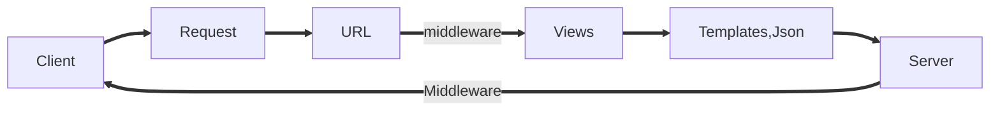
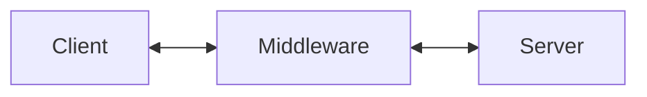
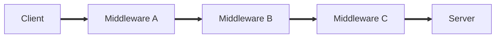
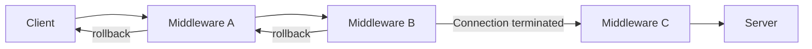

## MiddleWare

What is middle ware is class of python which hooks with request and response cycle of Django..



​																												fig.MVT																					



​																												fig. Simplified version

- In settings.py middleware runs from top to bottom for **request cycle**.

- while for **response cycle** it goes from bottom to top.

**Types of Middleware**

- **Function based Middleware**
- **Classed based Middleware**

## Project

1. start project with name middleware
2. Start app with name app.
3. Register app
4. Initialize database (**middleware)**
5. Create data base with name **middleware**

- Settings.py 

```python
from django.shortcuts import render
from django.http import HttpResponse
# Create your views here.

def home(request):
    print('In view function')
    return HttpResponse("<h1>Hello you are in home view response</h1>")

def greet(request):
    print('In view function')
    return HttpResponse("<h1>Hello you are in greet view response</h1>")

def function(request):
    print('In view function')
    return HttpResponse("<h1>Hello you are in function view response</h1>")
```

## Function based middleware

-  url.py

```python
from django.contrib import admin
from django.urls import path
from app.views import home, greet, function

urlpatterns = [
    path('admin/', admin.site.urls),
    path('home/', home,name = "home"),
    path('greet/', greet,name = "greet"),
    path('function/', function,name = "function"),
]
```

- Create a **middlewares** in app folder

```python
from django.http.response import HttpResponse


def my_middleware(get_respone):
    # one time configurattion and initiation
    print("Configuration...!") # It will initilize once when runserver
    def middleware(request):
        # code to be executed for each request before 
        # the views (and later middleware) is called.
        print('Before calling views')
        response =  get_respone(request) # view()
        print(response.content, 'response')
        print("After calling views")

        # code to be executed for each request/ response
        # after the view is called.
        
        # return HttpResponse("Bye Bye")
        return response

    return middleware
```

> my_middleware will called in Django after runserver you can also see

```powershell
October 03, 2021 - 16:03:14
Django version 3.2.6, using settings 'middleware.settings'
Starting development server at http://127.0.0.1:8000/
Quit the server with CTRL-BREAK.
Configuration...!
```

> So when server runs initialization of your middleware happen like a **constructor**

- Lets hit the home URL

```powershell
Before calling views
In view function
After calling views
```

## Class based middleware

```python
class MyMiddleware:
    def __init__(self, get_response):
        self.get_response = get_response
        print("One-time configuration and initialization.")
        # One-time configuration and initialization.

    def __call__(self, request):
        print("Before calling View")
        response = self.get_response(request)
        print("After calling View")
        return response
```

Console: After calling home

```shell
Django version 3.2.6, using settings 'middleware.settings'
Starting development server at http://127.0.0.1:8000/
Quit the server with CTRL-BREAK.
One-time configuration and initialization.
Before calling View
In view function
After calling View
```

### \_\_Call\_\_ Method example

```python
class Student:
    def __init__(self, name):
        self.Name = name

    # def __repr__(self): # Return when want to print object of class
    #     return f"name is {self.Name}"
    
    def __call__(self, marks): # make objects callable
        print(f"marks are {marks}")

s1 = Student("Piyush")
s1(65)
```

> **Middleware can be use to configure which app is going to access which database**.

## Multiple middlewares (Chaining Middleware's)



```python
class MyMiddleware_A:
    def __init__(self, get_response):
        self.get_response = get_response
        print("One-time configuration and initialization.... A")
        # One-time configuration and initialization.

    def __call__(self, request):
        print("Before calling View -- cw -- A")
        response = self.get_response(request)
        print("After calling View -- cw -- A")
        return response


class MyMiddleware_B:
    def __init__(self, get_response):
        self.get_response = get_response
        print("One-time configuration and initialization.... B")
        # One-time configuration and initialization.

    def __call__(self, request):
        print("Before calling View -- cw -- B")
        response = self.get_response(request)
        print("After calling View -- cw -- B")
        return response


class MyMiddleware_C:
    def __init__(self, get_response):
        self.get_response = get_response
        print("One-time configuration and initialization.... C")
        # One-time configuration and initialization.

    def __call__(self, request):
        print("Before calling View -- cw -- C")
        response = self.get_response(request)
        print("After calling View -- cw -- C")
        return response
```

- In settings.py

```python
MIDDLEWARE = [
    'django.middleware.security.SecurityMiddleware',
    'django.contrib.sessions.middleware.SessionMiddleware',
    'django.middleware.common.CommonMiddleware',
    'django.middleware.csrf.CsrfViewMiddleware',
    'django.contrib.auth.middleware.AuthenticationMiddleware',
    'django.contrib.messages.middleware.MessageMiddleware',
    'django.middleware.clickjacking.XFrameOptionsMiddleware',
    # 'app.middlewares.my_middleware', deactivated
    'app.middlewares.MyMiddleware_A',
    'app.middlewares.MyMiddleware_B',
    'app.middlewares.MyMiddleware_C',
```

**Console: After runserver**

```shell
One-time configuration and initialization.... C
One-time configuration and initialization.... B
One-time configuration and initialization.... A
```

Middleware will be executed from **Bottom to Top**.

**Console: After Hitting views**

```shell
Before calling View -- cw -- A
Before calling View -- cw -- B
Before calling View -- cw -- C
In view function
After calling View -- cw -- C
After calling View -- cw -- B
After calling View -- cw -- A
```

## Breaking the chain of middle ware for some reason

```python
class MyMiddleware_A:
    def __init__(self, get_response):
        self.get_response = get_response
        print("One-time configuration and initialization.... A")
        # One-time configuration and initialization.

    def __call__(self, request):
        print("Before calling View -- cw -- A")
        response = self.get_response(request)
        print("After calling View -- cw -- A")
        return response


class MyMiddleware_B:
    def __init__(self, get_response):
        self.get_response = get_response
        print("One-time configuration and initialization.... B")
        # One-time configuration and initialization.

    def __call__(self, request):
        print("Before calling View -- cw -- B")
        res = HttpResponse("<h1>Somethiing Wrong Happenend!!!</h1>") # detecting authentification failed
        # response = self.get_response(request)
        print("After calling View -- cw -- B")
        return res
        return response


class MyMiddleware_C:
    def __init__(self, get_response):
        self.get_response = get_response
        print("One-time configuration and initialization.... C")
        # One-time configuration and initialization.

    def __call__(self, request):
        print("Before calling View -- cw -- C")
        response = self.get_response(request)
        print("After calling View -- cw -- C")
        return response
```

Here in MyMiddleware_B for some unknown reason if we have to roll back and terminated the respones this pattern will be followed



```shell
Before calling View -- cw -- A
Before calling View -- cw -- B
After calling View -- cw -- B
After calling View -- cw -- A
```

```python
'django.middleware.security.SecurityMiddleware', 
'django.contrib.sessions.middleware.SessionMiddleware', # session related operations
'django.middleware.common.CommonMiddleware',
'django.middleware.csrf.CsrfViewMiddleware', # csrf token
'django.contrib.auth.middleware.AuthenticationMiddleware', # login and log out
'django.contrib.messages.middleware.MessageMiddleware',
'django.middleware.clickjacking.XFrameOptionsMiddleware', # To avoid hacking related operations like phishing
```

----

## Hooks

Function like call and init are called hooks.

### *process_view(self, request, view_func, view_args, view_kwargs)*

```python
class HooksMiddleware:
    def __init__(self, get_response):
        self.get_response = get_response
        print("One-time configuration and initialization.... Hook")
        # One-time configuration and initialization.

    def __call__(self, request):
        print("Before calling View -- cw -- Hook")
        response = self.get_response(request)
        print("After calling View -- cw -- Hook")
        return response

    def process_view(self, request, view_func, view_args, view_kwargs):
        print("In process view")
        return None
```

> It is called before view function

Console:

```shell
One-time configuration and initialization.... Hook
Before calling View -- cw -- Hook
In process view <<====
In view function
After calling View -- cw -- Hook
```

- Returning HTTP response

```python
class HooksMiddleware:
    def __init__(self, get_response):
        self.get_response = get_response
        print("One-time configuration and initialization.... Hook")
        # One-time configuration and initialization.

    def __call__(self, request):
        print("Before calling View -- cw -- Hook")
        response = self.get_response(request)
        print("After calling View -- cw -- Hook")
        return response

    def process_view(self, request, view_func, view_args, view_kwargs):
        print("In process view")
        return HttpResponse(f"You can not call {view_func.__name__} view function.. ") # won't call view function
        # return None   #Will allow to access the view function 
```

Console

```powershell
One-time configuration and initialization.... Hook
Before calling View -- cw -- Hook
In process view   <<=== {{home view bypassed}}
After calling View -- cw -- Hook
```

---

### *process_exception(self, request, exception)*

```python
class HooksMiddleware:
    def __init__(self, get_response):
        self.get_response = get_response
        print("One-time configuration and initialization.... Hook")
        # One-time configuration and initialization.

    def __call__(self, request):
        print("Before calling View -- cw -- Hook")
        response = self.get_response(request)
        print("After calling View -- cw -- Hook")
        return response

    def process_view(self, request, view_func, view_args, view_kwargs):
        print("In process view")
        # return HttpResponse(f"You can not call {view_func.__name__} view function.. ") # won't call view function
        return None   #Will allow to access the view function 
    
    def process_exception(self, request, exception):
        msg = f'{exception.__class__.__name__}{exception}'
        return HttpResponse(msg)
```

Http Response

```shell
ZeroDivisionErrordivision by zero  # we have raised that error manually in view 
```

----

### process_template_response(self, request, response)

```python
class HooksMiddleware:
    def __init__(self, get_response):
        self.get_response = get_response
        print("One-time configuration and initialization.... Hook")
        # One-time configuration and initialization.

    def __call__(self, request):
        print("Before calling View -- cw -- Hook")
        response = self.get_response(request)
        print("After calling View -- cw -- Hook")
        return response

    def process_view(self, request, view_func, view_args, view_kwargs):
        print("In process view")
        # return HttpResponse(f"You can not call {view_func.__name__} view function.. ") # won't call view function
        return None   #Will allow to access the view function 
    
    def process_exception(self, request, exception):
        msg = f'{exception.__class__.__name__}{exception}'
        return HttpResponse(msg)

    def process_template_response(self, request, response):
            response.context_data['name'] = "Tejaswini"
            print("In Process Template Response")
            return response
```

**in middle ware**

I will modify name value to Tejaswini which was Sharique...

### Common middle ware

If you **APPEND_SLASH = False** will disable autocomplete when typing url..

content_length will display length of data send by user to html.


## Reference

Django documentation [click me](https://docs.djangoproject.com/en/3.2/topics/http/middleware/)

Hooks [click me](https://simpleisbetterthancomplex.com/tutorial/2016/07/18/how-to-create-a-custom-django-middleware.html)

Valentinog [click me](https://www.valentinog.com/blog/django-middleware/)

Created_By = **"Mohammad_Sharique"**

