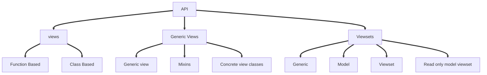
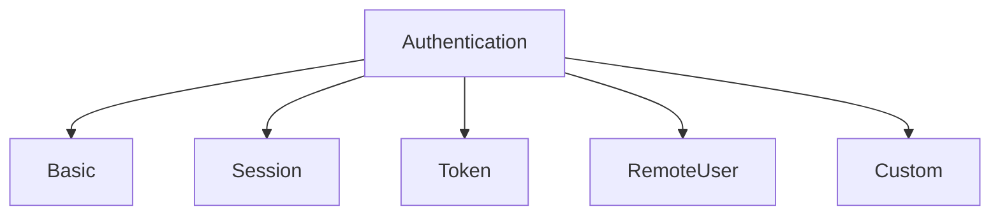

# **REST** API

### What is API:-

- **Application Program Interface** or API is used to communicate between two program i,e intermediate.
- Example of API in real world:-
  - Waiter as an **API**
  - Cook as a **Server**
  - Customer as a **Client** 
- Type of API public release
  - **Private** within the application of within the company
  - **Partner** within the companies parterner
  - **Public** It can be access by developers

- Terms related to API:-
  - Provider:- Who provides API services
  - Consumer :- User of API services


### Need of API:-

1. Suppose various user want data from site. You just need to provide API services and that it any one can access your data.
2. Suppose there in a data base depending upon your application.
   1. This data has to be access by various technologies ie mobile, java application etc.
   2. Then Just simply using API services all these software can access same data base and no need to provide different database of each other.
3. suppose server only support java based application for interaction and the client web site is written in python. The either we have to convert server in python or client in java. But suppose there is an another app from mobile phone than what so this difference of technology can be tackled using API as it will interact between server and client and give the access to the server for that.

**References**:-

1. Django REST framework [click me](https://www.django-rest-framework.org/api-guide/generic-views/)
2. Routers [click me](https://www.django-rest-framework.org/api-guide/routers/)



**Difference between PUT, POST, GET, DELETE and PATCH IN HTTP Verbs:**

The most commonly used HTTP verbs POST, GET, PUT, DELETE are similar  to CRUD (Create, Read, Update and Delete) operations in database. We  specify these HTTP verbs in the **capital** case. So, the below is the comparison between them.

1. create - POST 
2. read - GET
3. update - PUT
4. delete - DELETE

**PATCH:** Submits a partial modification to a resource. If you only need to update one field for the resource, you may want to  use the PATCH method.

**Note:**
 **Since POST, PUT, DELETE modifies the content, the tests with  Fiddler for the below url just mimicks the updations. It doesn't delete  or modify actually. We can just see the status codes to check whether  insertions, updations, deletions occur.**

### **1. GET:-**

GET is the simplest type of HTTP request method; the one that  browsers use each time you click a link or type a URL into the address  bar. It instructs the server to transmit the data identified by the URL  to the client. Data should never be modified on the server side as a  result of a GET request. In this sense, a GET request is read-only.

**Checking with Fiddler or PostMan:** We can use Fiddler for checking the response. Open Fiddler and select the Compose tab. Specify the verb and url as shown below and click Execute to check the response.

**Verb:** GET

**Response:** You will get the response as:

```json
{"id": 11, "name"="Sharique","Age":25,"Address":"Amravati"}
```

In the “happy” (or non-error) path, GET returns a representation in  XML or JSON and an HTTP response code of 200 (OK). In an error case, it  most often returns a 404 (NOT FOUND) or 400 (BAD REQUEST).

### **2. POST:-**

The POST verb is mostly utilized to **create** new  resources. In particular, it's used to create subordinate resources.  That is, subordinate to some other (e.g. parent) resource. 

On successful creation, return HTTP status 201, returning a Location  header with a link to the newly-created resource with the 201 HTTP  status.

**Checking with Fiddler or PostMan:** We can use Fiddler for checking the response. Open Fiddler and select the Compose tab. Specify the verb and URL as shown below and click Execute to check the response.

**Verb:** POST

**Request Body:** 

```json
data: {title: 'foo', body: 'bar', userId: 1000, Id : 1000 }
```

**Response:** You would receive the response code as 201.

If we want to check the inserted record with Id = 1000 change the verb to Get and use the same url and click Execute.

As said earlier, the above url only allows reads (GET), we cannot read the updated data in real.

### **3. PUT:-**

PUT is most-often utilized for **update** capabilities,  PUT-ing to a known resource URI with the request body containing the  newly-updated representation of the original resource.

**Checking with Fiddler or PostMan:** We can use Fiddler for checking the response. Open Fiddler and select the Compose tab. Specify the verb and URL as shown below and click Execute to check the response.

**Verb:** PUT

**Request Body:** 

```json
data: { title: 'foo', body: 'bar',userId: 1, Id : 1 }
```

**Response:** On successful update it returns 200 (or 204 if not returning any content in the body) from a PUT.

### **4. DELETE:-**

DELETE is pretty easy to understand. It is used to **delete** a resource identified by a URI. 

On successful deletion, return HTTP status 200 (OK) along with a  response body, perhaps the representation of the deleted item (often  demands too much bandwidth), or a wrapped response (see Return Values  below). Either that or return HTTP status 204 (NO CONTENT) with no  response body. In other words, a 204 status with no body, or the  JSEND-style response and HTTP status 200 are the recommended responses.

**Checking with Fiddler or PostMan:** We can use Fiddler for checking the response. Open Fiddler and select the Compose tab. Specify the verb and URL as shown below and click Execute to check the response.

**Verb:** DELETE

**Response:** On successful deletion it returns HTTP status 200 (OK) along with a response body.

---------------------------------

**Example between PUT and PATCH**

**PUT** 

If I had to change my first_name then send PUT request for Update:

```json
data: { "first": "Mohammad", "last": "Sharique" } 
```

So, here in order to update the first name we need to send all the parameters of the data again.

**PATCH**

Patch request says that we would only send the data that we need to  modify without modifying or effecting other parts of the data. Ex: if we need to update only the first name, we pass only the first  name.

```json
data: {"first":"Mohammad"}
```


**Summery:-**

| Request Type        | Verbose | Success status | Error status   | example                                                   |
| ------------------- | ------- | -------------- | -------------- | --------------------------------------------------------- |
| Get   **(read)**    | GET     | **200**        | **400 or 404** | **{"id": 11}**                                            |
| Post **(create)**   | POST    | **201**        |                | **{"name"="Sharique","Age":25,"Address":"Amravati"}**     |
| Put **(update)**    | PUT     | **200**        | **400 or 204** | **{"id":11,"name"="Sharique","Age":30,"Address":"Pune"}** |
| Delete **(delete)** | DELETE  | **200**        | **204**        | **{"id": 11}**                                            |
| Patch               | PATCH   |                |                | **{"id":11,"name"="Sharique"}**                           |

**Status codes**

| Status Code | Meaning           |
| ----------- | ----------------- |
| 200         | OK                |
| 201         | Success Creation  |
| 204         | Content not found |
| 400         | Bad Request       |
| 404         | Not Found         |


- rest api framwork
- serilalizer
  - model serializer
- class meta
  - feilds = []
  - fields = '__all__'
  - exclude
  - read_only_feild
  - extra kwargs**
- validators
- API
  - function base api
  - view based api_view
  - browsable api
- Api types
  - postman
  - curl
  - browsable api
  - api client
- Quary_Param
- Mixin
  - list model mixin
  - retrieve model mixin
  - create model mixin
  - update model mixin
  - destroy model mixin
- Generic API viewe

router type:-

default router and simple router


## REST Swagger

**Reference:- ** 

1. REST swagger [click me](https://django-rest-swagger.readthedocs.io/en/latest/)

## Installation

```
$ pip install django-rest-swagger
```

Add `'rest_framework_swagger'` to `INSTALLED_APPS` in Django settings.

**settings.py**

```python
INSTALLED_APPS = [
    ...
    'rest_framework_swagger',
    ...
]
```

## Quick start

To quickly get started, use the `get_swagger_view` shortcut. This will produce a schema view which uses common settings. For more advanced usage, please see the schemas section.

#### Example

**views.py**

```python
from django.conf.urls import url
from rest_framework_swagger.views import get_swagger_view

schema_view = get_swagger_view(title='Pastebin API') # name of API swagger

urlpatterns = [
    url(r'^$', schema_view)
]
```


## Authentication /  Authorized

**References** :-   **[click me](https://www.django-rest-framework.org/api-guide/authentication/)**

| User Type  | is_superuser | is_staff | is_active |
| ---------- | :----------- | -------- | --------- |
| Super User | 1            | 1        | 1         |
| Sub Admin  | 0            | 1        | 1         |
| User       | 0            | 0        | 1         |

Authentication should run before running views.

### Types of Authentication:-




| Authentication Type       | Application              | Login methode                                                |
| ------------------------- | ------------------------ | ------------------------------------------------------------ |
| Basic Authentication      | For testing purpose only | Pop up arrives when not logged in                            |
| Session Authentication    | Session Based login      | Need to provide DRF url and it adds login/logout button by itself. |
| Token Authentication      |                          |                                                              |
| RemoteUser Authentication |                          |                                                              |
| Custom Authentication     |                          |                                                              |


## Permissions:-

> Superuser have all privilege's. If he want to give permission to **SubAdmin**.  [**For more info**](https://www.django-rest-framework.org/api-guide/permissions/)


### Types Of Permission:-

| Permission Type                           | Requirements                                                 |
| ----------------------------------------- | ------------------------------------------------------------ |
| **AllowAny**    [default permission Type] | Allows any one                                               |
| **isAuthenticated**                       | Only for registered users [**Admin,Staff and User**]         |
| **isAdminUser**                           | Only **Staff** and **Admin**.                                |
| **isAuthenticatedOrReadOnly**             | For registered users [**Admin,Staff and User**] and Read only field view |
| **DjangoModelPermissions**                |                                                              |
| **DjangoModelPermissionsOrReadOnly**      |                                                              |
| **DjangoObjectPermissions**               |                                                              |

- Default setting for DRF in settings.py

```python

```


## Token Authentication

- You will need username first time to generate token.
-  Token is generated respective user [one and unique for that user only].
- There are multiple ways to generate token
  - **Admin UI**
  - **Python manage.py drf_create_token username**
  - **API Endpoint - function based - need to pass username and password**
  - **Using single automatically generating token for user when created.**

use simple in better than coplex for more references.

### Admin UI

add following line in installed app settings.py

```python
INSTALLED_APPS = [
....
'rest_framework_authtoken',
]

#for global authenticatoin

REST_FRAMEWORK = {
    'DEFAULT_AUTHENTICATION_CLASSES': [
        'rest_framework.authentication.TokenAuthentication'
    ],
}
```

**reference:-** Simpleisbetterthancomplex    [click me](https://simpleisbetterthancomplex.com/tutorial/2018/11/22/how-to-implement-token-authentication-using-django-rest-framework.html)

> **If the token is already generated then it will just return it and if there is no token then it will generate one.**

#### 1. Providing Token using PostMan:-

1. open post man
2. in header search for authentication
3. type `Token token_genrated`
4. Then perform whatever operation you want to do.

#### 2. Using httpie

1. paste the URL you needed with

```powershell
http url_you_needed "Authorization: Token genrated_token"
```

#### 3. API Endpoint Token generation

> In your main url.py past this code

```python
from django.urls import path
from rest_framework.authtoken.views import obtain_auth_token  # <-- Here
from myapi.core import views

urlpatterns = [
    path('hello/', views.HelloView.as_view(), name='hello'),
    path('api-token-auth/', obtain_auth_token, name='api_token_auth'),  # <-- And here
]
```

In body of PostMan select Json type this

```json
{"username":"Sharique", "password":"admin@123"}
```


**Reference** :- medium [click me](https://medium.com/quick-code/token-based-authentication-for-django-rest-framework-44586a9a56fb)

1. Past this code in <span style = "color:red">`views.py`</span> 

```python
from django.contrib.auth import authenticate
from django.views.decorators.csrf import csrf_exempt
from rest_framework.authtoken.models import Token
from rest_framework.decorators import api_view, permission_classes
from rest_framework.permissions import AllowAny
from rest_framework.status import (
    HTTP_400_BAD_REQUEST,
    HTTP_404_NOT_FOUND,
    HTTP_200_OK
)
from rest_framework.response import Response


@csrf_exempt
@api_view(["POST"])
@permission_classes((AllowAny,))
def login(request):
    username = request.data.get("username")
    password = request.data.get("password")
    if username is None or password is None:
        return Response({'error': 'Please provide both username and password'},
                        status=HTTP_400_BAD_REQUEST)
    user = authenticate(username=username, password=password)
    if not user:
        return Response({'error': 'Invalid Credentials'},
                        status=HTTP_404_NOT_FOUND)
    token, _ = Token.objects.get_or_create(user=user)
    return Response({'token': token.key},
                    status=HTTP_200_OK)
```


2. Modify main **urls.py** 

```python
from first_app.viws import login_token


urlpatterns = [
    path('admin/', admin.site.urls),
    path('login-token/', login_toke, name ="api_token_auth")
]
```


3. In body of PostMan select Json type this

```json
{"username":"Sharique", "password":"admin@123"}
```

It will return following output:-

```json

```

<strong><span style = "color : red">Note:</span></strong> <span style = "color: Green"> Above token were simple token as it does not have any expiry date .<br>And It is not advisable to keep using this kind of token for long time as could raise security threat for production.</span>

---

#### 4. Token Generation Using Signals

##### 1. Simple Token

Features :- Have an expiry and secured API.

You need to generate token whenever the user is created. Though you need to have method to fetch token.

Past this code in <span style = "color:red">`models.py`</span>.

```python
from django.conf import settings
from django.db.models.signals import post_save
from django.dispatch import receiver
from rest_framework.authtoken.models import Token

@receiver(post_save, sender=settings.AUTH_USER_MODEL)
def create_auth_token(sender, instance=None, created=False, **kwargs):
    if created:
        Token.objects.create(user=instance)
```

Just for understanding the functionality of signals

```python
@receiver(post_save, sender=student)
def say_hello(sender, instance=None, created=False, **kwargs):
    if created:
        print(f"Hello Good Morning.... {instance.name}!")
```

 This will return greeting message with user name.

If we want to print **Bye Bye message** when the user is deleted.

```python
@receiver(post_save, sender=student)
def say_hello(sender, instance=None, **kwargs):
    if created:
        print(f"Bye Bye.... {instance.name}!")
```

##### 2  JWT - Jason Web Token Generation

<span style = "color : green">Reference :-</span> simpleisbetterthancomplex [click me](https://simpleisbetterthancomplex.com/tutorial/2018/12/19/how-to-use-jwt-authentication-with-django-rest-framework.html)

- You need to pass credentials i.e. username and password to get token. 
- Whenever You logged in you will nee two tokens. 

- JWT token types:-

1. Access token -- Short-lived for 5min and can be customizable.
2. Refresh token -- long -lived for 24hours and customizable.

- You use **Refresh_Token** to get **Access_Token** which expires shortly after sometime. 
- When **Refresh_Token** expires you have to log in again to get both of the token. 

<span style = "color:Green">Use reference for full documentation</span>

Refresh and Access will stored in session not in database table.

## Filters

**Reference**:- Filtering   [click me](https://www.django-rest-framework.org/api-guide/filtering/) 

- Write a new view function
- Override **get_queryset(self)** methode for e.g

```python
class StudListF(ListAPIView):
    queryset = Student.objecst.all()
    serializer_class = StudentSerializer
	
    def get_queryset(self):
        return Student.objects.filter(city="pune")
```


## Pagination drf

**Reference**:- 	Pagination [click me](https://www.django-rest-framework.org/api-guide/pagination/)

### Page number pagination

## Serializer Relation

**Reference**:-   Serializer 	[click me](https://www.django-rest-framework.org/api-guide/relations/)

## Project 

**Reference**:- 	Medium [click me](https://medium.com/@gurupratap.matharu/build-a-restapi-using-nested-serializers-in-django-rest-framework-c0f6a31fd865)

## Test Driven Rest API

**Reference**:- Real Python   [click me](https://realpython.com/test-driven-development-of-a-django-restful-api/#objectives)

### How to use postgresql

**Reference** :-   eternprisedb   [click me](https://www.enterprisedb.com/postgres-tutorials/how-use-postgresql-django)


## Q & A

1. what is small integerfield
2. what is **lookup_field**, **lookup_url_kwarg** and **lookup_value_regex**? @list_rout


**Created_by = ShariqueDev**

