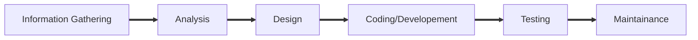

## Personality development by Pratik Sir

### SDLC (software development life cycle)

1. #### Information Gathering:-

   - Client will inform about the requirement of software.
   - Collecting relevant information from the client.  
   - Business Analysts mediator between client and company.
   - It provides **SRS (Software requirement specifications)** either word or ppt.
   - **SRS** also known as **customer requirement document**.(Higher authority Development leader and Testing leader)
   - SRS is derived from **BRS** (Business requirement specifications). We do not get BRS document.

2. #### Analysis:-

   - Analyzing the information we gathered from the client.
   - Review of analysis.

3. #### Design:-

   - HLD - High  level design [e.g going to eat poha (specific) ]
   - LLD - Low level design [e.g going to eat breakfast(in gernal)]
   - Review of design.

4. #### Coding/ Development:-

   - Creating Actual product.

5. #### Testing:-

   1. WBT - White box testing [developer] - By developer - Debugger
   2. BBT - Black box testing [tester] - By customer 
   3. Testing the product for bug and error.
   4. Using review tests are done.

6. #### Maintenance:-

   - Maintaining the product.

---

### SDLC Types:-

- Model - Fixed - Fixed requirement gathering
- Methodology - Flexible - requirement changes as per client

### Model

#### 1. waterfall model:-

- Where the next stage of **SDLC** do not get executed 100% development will not be executed.
- Here one person can manage complete **SDLC** process.
- But client can not be flexible as per his or her requirement as requirement is only asked for once and for all.

#### 2. Fish model:-

.png)

- upper part has actual documentation.
- lower part for review.

.png)

- lower work is done by review team.
- **CR** is for change request. 
  - If changes are minor do it directly. (changes between 10% to 15%)
  - If changes are major we will ask for new requirement and create new feature.(changes are more than 15%)
- Review part is also known as validation. Which is static method.
- CR is dynamic method.

-----

Developer - WBT - Static/glass/unit testing

Tester - BBT - End to End/ Dynamic testing - Verification

Gray Box Testing:- Things are moving from developing to testing then it is known as GBT

---

Agile methodology.

#### Scrum Agile:-

- Agile Actors
- Agile Architecture
- Agile terminology
- Agile meetings
- Agile features

---

#### Agile Actors:-

| Actual name                     | Actor name              |
| ------------------------------- | ----------------------- |
| Client                          | Solution Owner          |
| Business Analyst                | Product Owner           |
| Raw requirement                 | Product Backlog         |
| Actual requirement              | Sprint Backlog          |
| Module/ Build                   | Sprint                  |
|                                 | Stories                 |
|                                 | Estimations             |
| Manager                         | Scrum master            |
| Raw Plan of Testing             | Use cases               |
| Fixed Plan                      | Test Plan               |
| No.  of possible way of testing | Test senarios           |
| Proof of Testing                | Test cases              |
| Account Manager                 | Stack Holder            |
| Developer/Tester/leader         | Developer/Tester/leader |

---

#### WBT

- **Executional Test:-** Testing code by executing. --- As three years experience we always do this tests.
- **Mutational Test:-**  Writing code without changing the outcome of the test
- **Operational Test:-**  Sequencing the code to generate the needed output.

note:- Master code is a code which is combination of different code written by different developer.

- We can track the progress in SDLC.

- We can distribute the roles and responsibility.

- While IG, A and D are preparing their work. Developer and tester are preparing for development and testing.

- **V** model in which developer and tester work together. V can be converted into Agile.
- **Spiral ** model used there is no reference we us spiral model. we can use SAAS in spiral but output is not expected and there is no guarantee of output. If we fail in any stage of SDLC we have to start again.
- We only know about **Fish and Water fall ** model.
- PAAS (product as a service) and SAAS(Software as a service )
- Agile is handled using **JIRA** tool.

#### Homework:- 

- Format of white box testing. 

