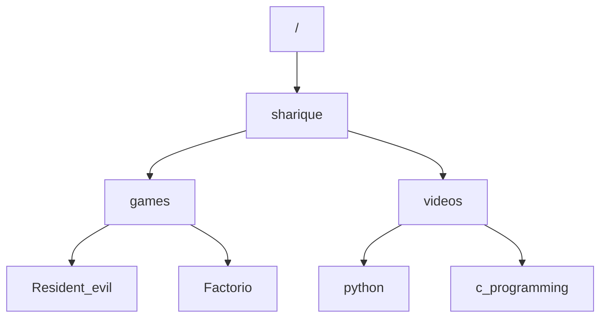

## **Unix commands**

| **command**                          | **description**                                              |
| ------------------------------------ | ------------------------------------------------------------ |
| **ls**                               | **To list all content in directory (to know children directory)** |
| **pwd**                              | **print working directory (To know who is parent directory)** |
| **/**                                | **root node**                                                |
| **dir**                              | **To see all directory**                                     |
| **cd**                               | **To change directory**                                      |
| **mkdir**                            | **To make directory**                                        |
| **touch**                            | **Touch to create a file e.g touch test.txt**                |
| **mv test.txt *folder_name***        | **Will move test.txt to folder_name**                        |
| **cp test.txt *folder_name***        | **Will copy test.txt to folder_name**                        |
| **clear**                            | **To clear your screen**                                     |
| **nano *file_name***                 | **To open file in nano. To save file nano ctrl + x Then Y and then enter.** |
| **python3 *file_name.py***           | **To execute python file.**                                  |
| **sudo**                             | **To access the root user may ask password**                 |
| **sudo apt-get update**              | **To update linux**                                          |
| **sudo apt-get install python3-pip** | To install pip in linux                                      |

## **Users in Linux**

1. **Regular user -- home directory**
2. **Root usre -- Full access also known as superuser**
   1. **Can use sudo commands**
3. **Service user -- Provides services have their own account**

## **Absolute vs Relative path**

#### **Absolute path**

**absolute path for Factorio `/sharique/games/factorio` it wouldn't be affected even if you change your current working directory.**

#### **Relative Path**

**If you are working in sharique then your relative path for factorio would be `/games/factorio`.**

**[click here](https://www.codewithharry.com/videos/learn-javascript-in-one-video-in-12)**

wls till 1:29:00