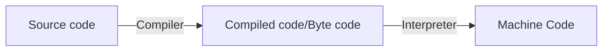

# Python Advantages and Disadvantages

## Advantages of Python

#### 1. Easy to Read, Learn and Write

Python is a **high-level programming language** that has English-like syntax. This makes it easier to read and understand the code.

Python is really easy to **pick up** and **learn**, that is why a lot of people recommend Python to beginners. You need  less lines of code to perform the same task as compared to other major  languages like **C/C++** and **Java**.

#### 2. Improved Productivity

Python is a very **productive language**. Due to the simplicity of Python, developers can focus on solving the  problem. They don’t need to spend too much time in understanding the **syntax** or **behavior** of the programming language. You write less code and get more things done.

#### 3. Interpreted Language

Python is an interpreted language which means that Python directly **executes the code** line by line. In case of any error, it stops further execution and reports back the error which has occurred.

Python shows only one error even if the program has multiple errors. This makes **debugging** easier*.*

#### 4. Dynamically Typed

Python doesn’t know the type of variable until we run the code. It automatically assigns the data type during **execution**. The programmer doesn’t need to worry about declaring variables and their data types.

#### 5. Free and Open-Source

Python comes under the **OSI approved** open-source license. This makes it **free** to **use** and **distribute**. You can download the source code, modify it and even distribute your  version of Python. This is useful for organizations that want to modify  some specific behavior and use their version for development.

#### 6. Vast Libraries Support

The standard library of Python is huge, you can find almost all the  functions needed for your task. So, you don’t have to depend on external libraries.

But even if you do, a **Python package manager (pip)** makes things easier to import other great packages from the **Python package index (PyPi)**. It consists of over 200,000 packages.

#### 7. Portability

In many languages like C/C++, you need to change your **code** to run the program on different platforms. That is not the same with Python. You only write once and run it anywhere.

However, you should be careful not to include any **system-dependent features**.

## Disadvantages of Python

#### 1. Slow Speed

We discussed above that Python is an **interpreted** language and **dynamically-typed** language. The line by line execution of code often leads to **slow execution**.

The dynamic nature of Python is also responsible for the **slow speed** of Python because it has to do the extra work while executing code. So,  Python is not used for purposes where speed is an important aspect of  the project.

#### 2. Not Memory Efficient

To provide simplicity to the developer, Python has to do a little tradeoff. The Python programming language uses a **large amount of memory**. This can be a disadvantage while building applications when we prefer memory optimization.

#### 3. Weak in Mobile Computing

Python is generally used in **server-side programming**. We don’t get to see Python on the client-side or mobile applications because of the following reasons. Python is **not memory efficient** and it has **slow processing power** as compared to other languages.

#### 4. Database Access

Programming in Python is **easy** and **stress-free**. But when we are interacting with the database, it lacks behind.

The Python’s database access layer is primitive and underdeveloped in comparison to the popular technologies like **JDBC** and **ODBC**.

Huge enterprises need smooth **interaction** of complex legacy data and Python is thus rarely used in enterprises.

#### 5. Runtime Errors

As we know Python is a dynamically typed language so the data type of a  variable can change anytime. A variable containing integer number may  hold a string in the future, which can lead to **Runtime Errors**.

Therefore Python programmers need to perform thorough testing of the applications.

### Summary

Python is a **simple**, **versatile** and a complete **programming language**. It is a great choice for beginners up to professionals. Although it has some disadvantages, we can observe that the advantages exceed the  disadvantages. Even Google has made Python one of its primary  programming languages.

# Data types

Bool :- True False

int(True) = 1

int(False) =0

True +True +False = 2

## List

- Collection of elements
- in []
- Duplication allowed
- Homogeneous, Heterogeneous allowed
- Ordered preserved